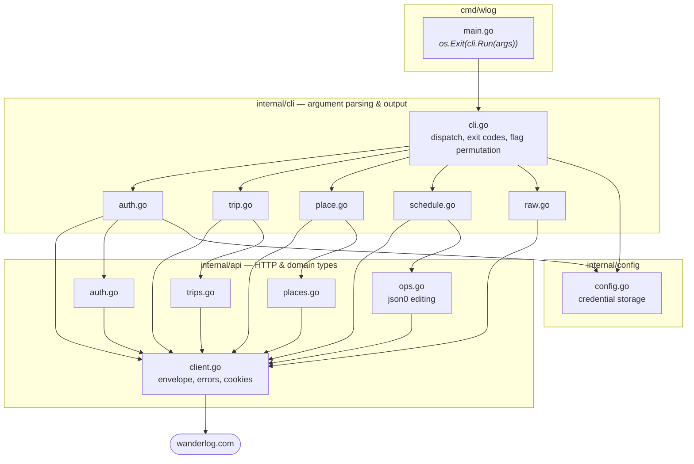
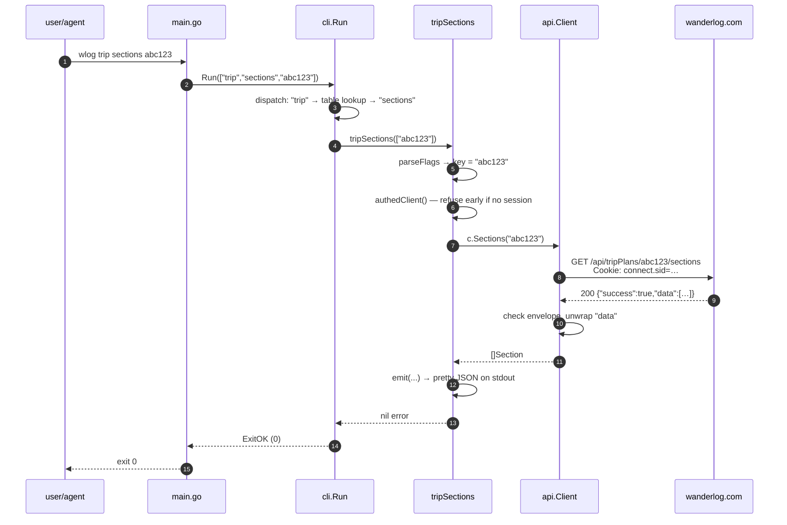
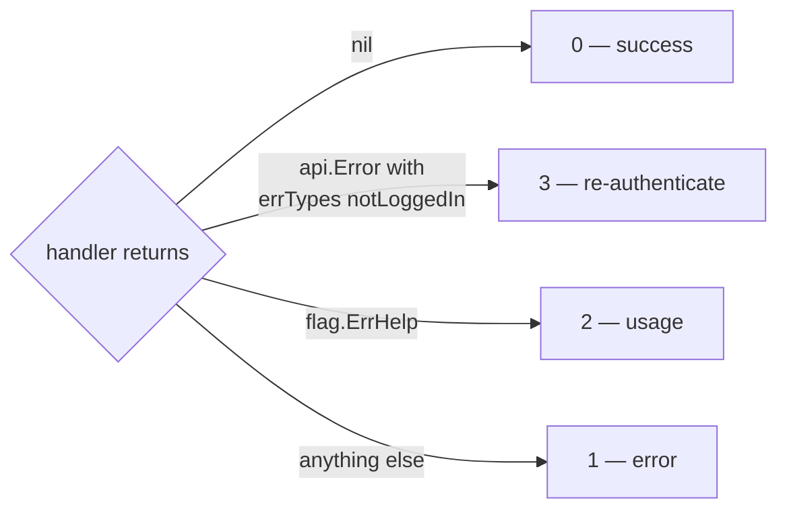
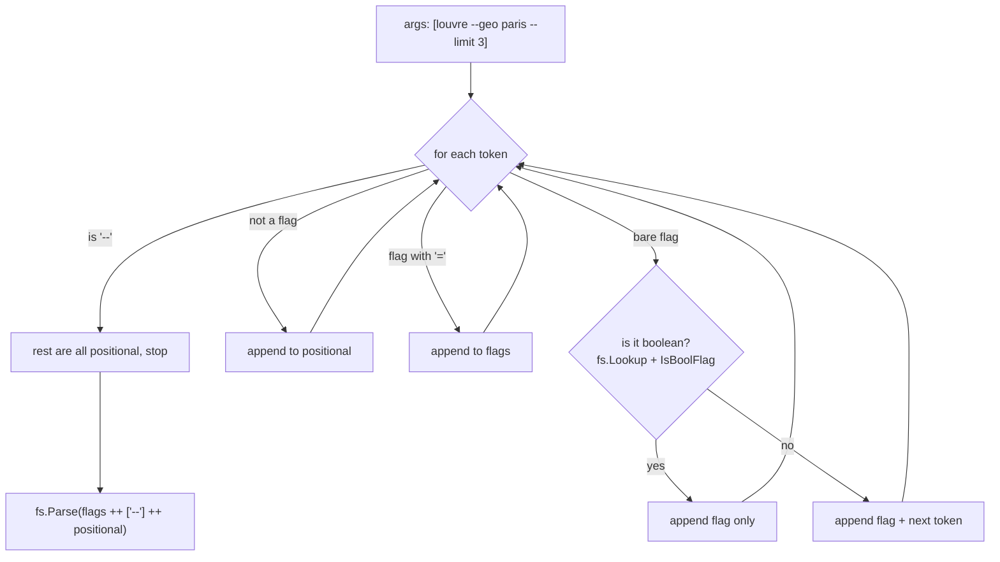
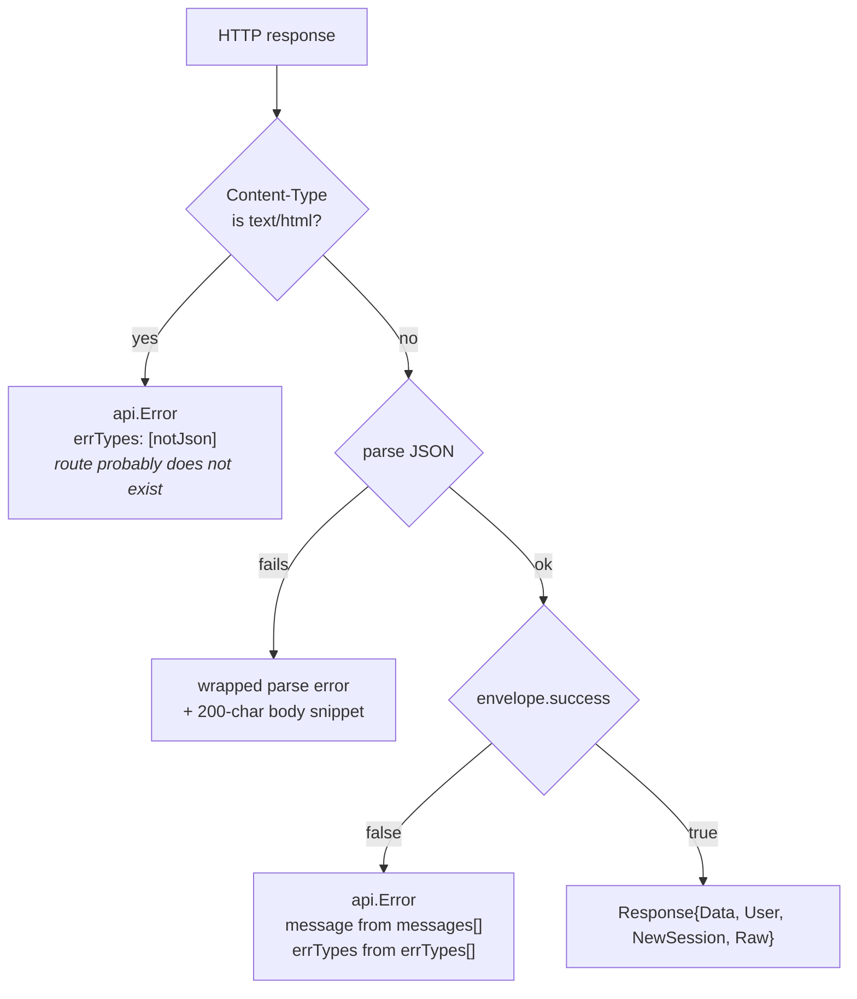
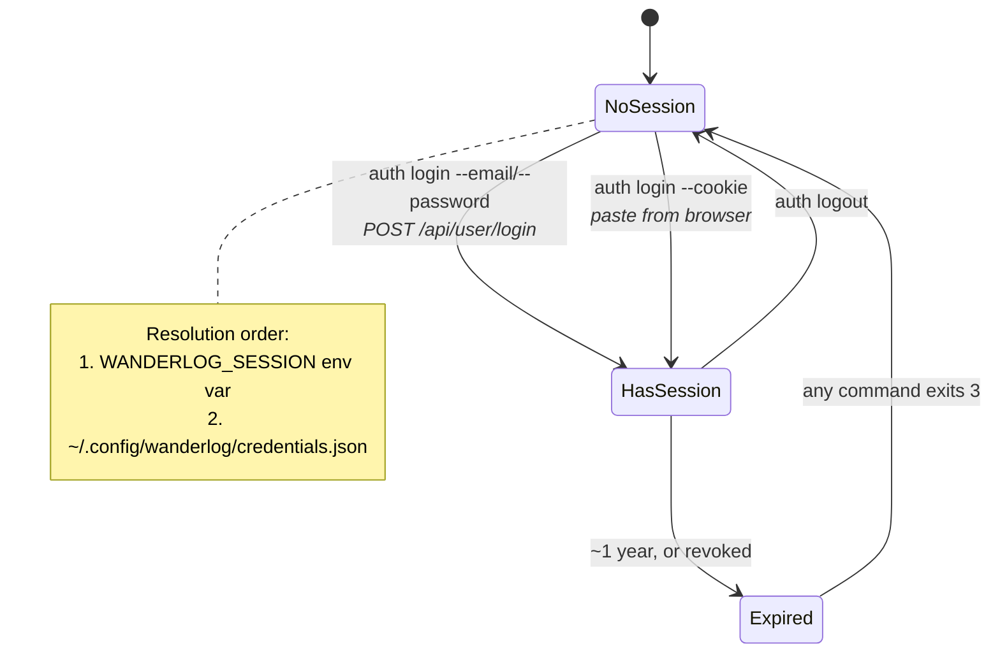
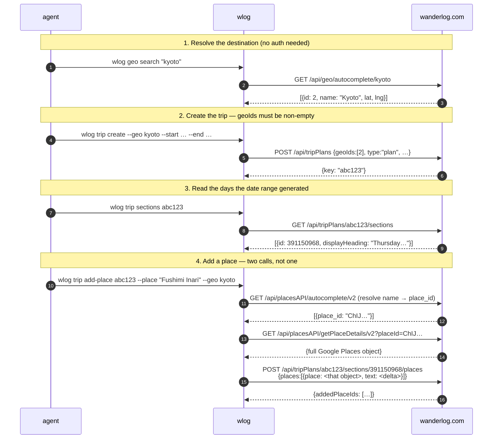

# Architecture

How `wlog` is put together, and why it is shaped this way.

Read this first. [SCHEDULING.md](SCHEDULING.md) goes deep on the itinerary
editing engine; [EXTENDING.md](EXTENDING.md) walks through adding a command.

Each section has the plain explanation first, then an **Advanced** block you can
expand for the details that matter once you are changing the code rather than
reading it.

---

## The one-paragraph version

Wanderlog has no public API. `wlog` drives the same private HTTP API the
Wanderlog web app uses, pretending to be a browser. It is a thin CLI over that
API, written for an AI agent to call: JSON on stdout, errors on stderr, stable
exit codes, no prompts.

---

## The three layers



The rule that keeps this clean:

| Layer | Knows about | Never does |
|---|---|---|
| `cmd/wlog` | nothing but `cli.Run` | anything else |
| `internal/cli` | flags, stdout/stderr, exit codes | HTTP, cookies |
| `internal/api` | HTTP, JSON, Wanderlog's quirks | printing, `os.Exit` |
| `internal/config` | the filesystem, env vars | HTTP |

If you find yourself calling `fmt.Println` inside `internal/api`, or building a
URL inside `internal/cli`, something has gone into the wrong layer.

<details>
<summary><b>Advanced — why there is no interface anywhere</b></summary>

`internal/api.Client` is a concrete struct, not an interface, and the CLI layer
depends on it directly. That is deliberate:

- **Tests do not need it.** Every API test spins up an `httptest.Server` and
  points `Client.BaseURL` at it. That exercises the real marshalling, the real
  cookie handling and the real envelope parsing — an interface with a mock
  would test none of those, and those are precisely the parts that have broken
  against the live API.
- **There is exactly one implementation** and no plausible second one. An
  interface would be speculative generality.

The seam that *does* exist is `Client.BaseURL` plus `Client.HTTP`. Anything you
need to fake, fake there.

The one place this bites: `internal/cli` functions take `*api.Client`, so a CLI
unit test needs a live-ish server. In practice the CLI tests only cover the pure
functions (`parseFlags`, `normalizePath`, `validTime`, `isDayHeading`) and the
integration surface is covered by the API tests plus manual runs against a real
account.
</details>

---

## Anatomy of a command

Every command follows the same path. `wlog trip sections abc123` for example:



Three things happen at step 3–5 that are worth knowing:

1. **Dispatch is a map lookup, not a framework.** `cli.go` has a `switch` on the
   command group and a `map[string]handler` per group. Adding a subcommand is
   one map entry.
2. **`wrap()` converts errors into exit codes.** Every handler returns `error`;
   `wrap` turns it into 0/1/2/3 and prints to stderr.
3. **`authedClient()` fails fast.** If no session is stored, the command errors
   before making a request, so you get a clear message instead of a server-side
   `notLoggedIn`.

### Exit codes



An agent should branch on `3` to trigger re-auth rather than pattern-matching
error text.

<details>
<summary><b>Advanced — flag permutation, and why Go's <code>flag</code> is not enough</b></summary>

Go's standard `flag` package **stops parsing at the first non-flag argument**.
So this silently drops `--geo`:

```bash
wlog place search "louvre" --geo paris
```

`fs.Parse` sees `"louvre"`, decides the flags are over, and leaves `--geo paris`
sitting in `fs.Args()`. No error. The command then fails with "needs a location
bias" and the user has no idea why.

Agents write arguments in natural order, so this was hit constantly.
`parseFlags` in `cli.go` fixes it by permuting the token stream into
flags-then-positionals before handing it to `fs.Parse`:



Two subtleties that are easy to get wrong, and that the tests pin:

- **Boolean flags must not swallow the next token.** `--allow-duplicates louvre`
  would otherwise consume `louvre` as the flag's value. `isBoolFlag` checks for
  the unexported `IsBoolFlag() bool` method that `flag`'s bool values implement.
- **The `--` terminator has to be re-inserted.** An earlier version dropped it,
  and a positional that looked like a flag (`wlog api GET -- --weird`) was
  reparsed as one. `TestParseFlagsPermutesInterleavedArgs` covers this; it is
  the test that caught the bug.

Consequence: `wlog` accepts flags anywhere, unlike most Go CLIs. Do not "fix"
this by reverting to plain `fs.Parse`.
</details>

<details>
<summary><b>Advanced — <code>normalizePath</code> and Git Bash on Windows</b></summary>

MSYS2 (Git Bash on Windows) rewrites arguments that look like Unix absolute
paths into Windows paths before the program sees them. So:

```bash
wlog api GET /api/user
```

arrives as `C:/Program Files/Git/api/user`. The request then 404s — or worse,
returns the SPA's HTML — and the error is baffling.

`normalizePath` in `raw.go` repairs it by trimming anything before the `/api/`
segment, and also normalises backslashes. It is deliberately narrow: it only
triggers when `/api/` appears at a non-zero index, so a legitimate path is left
alone. `TestNormalizePath` pins both directions.

The alternative is telling users to set `MSYS_NO_PATHCONV=1`, which is fine
for a human and useless for an agent.
</details>

---

## The API client

`internal/api/client.go` is small but it carries all of Wanderlog's
peculiarities. Two of them shape everything:

### Errors arrive as HTTP 200



If you branch on `resp.StatusCode` you will treat **every** failure as a
success. The envelope's `success` field is the only reliable signal. This is why
`Client.Do` never returns a raw `*http.Response`.

### Unknown routes return HTML, not 404

A path Wanderlog does not recognise falls through to the single-page app and
returns a full HTML document with status 200. Without the content-type check you
get `invalid character '<' looking for beginning of value`, which tells you
nothing. The check turns it into "the route likely does not exist".

<details>
<summary><b>Advanced — response envelope shapes, and why <code>GetTrip</code> is special</b></summary>

Most routes wrap their payload:

```jsonc
{ "success": true, "data": <payload> }
```

But not all:

| Route | Shape | Handled by |
|---|---|---|
| most | `{success, data}` | `Response.Data` |
| `/api/user` | `{success, user}` — **`user: null` when logged out, not an error** | `Response.User`, `Whoami` |
| `/api/tripPlans/{key}` | `{success, tripPlan, resources, guideResources, settings}` — **top level, no `data`** | `GetTrip` returns `Raw` with `success` stripped |

`GetTrip` is the one that catches people. It also **requires**
`clientSchemaVersion=2` as a query parameter; without it the server refuses with
`incompatibleItineraryConversion`, surfaced to the user as "your app is too
old". The constant lives in `api.ClientSchemaVersion` and was read out of the
web bundle. If that error reappears, Wanderlog bumped it — find the new value
and change the constant.

`Client.JSON` unwraps `data` for you. `Client.Do` gives you everything and is
what you want when the route is non-standard.

**Session rotation.** The server can hand back a new `connect.sid` on any
response. `Do` captures it into `Response.NewSession`, and `JSON` adopts it if
the client started anonymous. It deliberately does *not* overwrite an existing
session — that would let a stray response silently swap the user's credential.

**Other deliberate choices in `Do`:**

- `CheckRedirect` returns `http.ErrUseLastResponse`. Following a redirect lands
  you on an HTML page, which would then trip the content-type check with a
  confusing path. Better to see the redirect.
- The body is read through `io.LimitReader(…, 32<<20)`. A trip document is
  ~800 KB; the cap stops a runaway response from exhausting memory.
- A browser `User-Agent` is set. Wanderlog's edge rejects some routes with an
  empty or obviously-scripted UA.
</details>

---

## Authentication

Wanderlog uses an Express session cookie, `connect.sid`. There is no API key and
no OAuth app. Full detail in [AUTH.md](AUTH.md); here is how the code handles it.



Two ways in, because **accounts created through Google/Apple/Facebook have no
password**. For those, `POST /api/user/login` can never work, so the user pastes
a `connect.sid` from a signed-in browser instead.

<details>
<summary><b>Advanced — credential handling and the SSO detection hack</b></summary>

**Storage.** `config.Save` writes `0600` inside a `0700` directory. On Windows
the mode bits are inert — the file inherits the user profile's ACL, which is
already owner-scoped — so `os.Chmod` is skipped there rather than pretending it
did something.

`WANDERLOG_SESSION` takes precedence over the file and is the right choice for
CI or a sandboxed agent: nothing touches disk.

**Why `Whoami` returns `(nil, nil)` for a logged-out session.** `/api/user`
answers `{"success":true,"user":null}` — a *success* with a null user. Treating
that as an error would be wrong (the request worked), so the nil-user case is
the "not signed in" signal. Callers must check for `nil` explicitly;
`TestWhoamiReturnsNilWhenLoggedOut` pins it.

**The SSO hint in `cli/auth.go`.** When `POST /api/user/login` fails, the code
scans the returned `errTypes` for `"password"` or `"google"` and, if found,
appends a hint telling the user to try `--cookie`. This is a heuristic on
undocumented error slugs — if Wanderlog renames them the hint silently stops
appearing, but login still fails correctly with the server's own message. That
is the right failure mode: the hint is a convenience, not a dependency.

**Login response shape is unstable.** `api.Login` tries `resp.User`, then
`resp.Data`, and if neither yields a user id it falls back to a fresh `Whoami`
call with the new session. Belt and braces, because the shape has moved before.
</details>

---

## Building a trip

The single most important thing to understand about this API: **a place in an
itinerary is a full Google Places object, not an id**. The server keys off
`place_id` inside it and reads other fields from it too. A hand-built stub does
not work.



Step 4 is why `--place` accepts either a Google place id or a plain name: if you
give a name, `resolvePlace` does the autocomplete hop for you, which is why it
needs `--geo` or `--near` to disambiguate. "Eiffel Tower" matches Paris, Lahore
and Las Vegas.

<details>
<summary><b>Advanced — three traps in the trip endpoints</b></summary>

**1. `POST /api/tripPlans` demands every field.** Send a partial body and the
server answers a generic `unexpectedError` that names nothing. `CreateTripInput`
therefore has no `omitempty` on the structural fields — nulls and empty arrays
go on the wire explicitly:

```go
GeoIDs              []int   `json:"geoIds"`               // must be non-empty
InitialMapsPlaceIDs []int   `json:"initialMapsPlaceIds"`  // [] not null
InitialSections     any     `json:"initialSections"`      // null
Title               *string `json:"title"`                // null → server names it
```

`CreateTrip` normalises nil slices to `[]int{}` before sending, because a nil
slice marshals to `null` and the server wants an array.

Also: `type` is `"plan"`, not `"tripPlan"`. And `geoIds` must be non-empty —
a destination-less trip is refused with `noGeosForTripPlan`.

**2. Notes are Quill rich-text deltas, not strings.**

```jsonc
{"ops":[{"insert":"go at sunrise\n"}]}
```

The server **accepts a bare string without complaint** and stores it verbatim,
producing a note in a shape the editor never authors. The write looks successful
— `success: true`, exit 0 — and the damage is silent. `api.NoteDelta` builds the
wrapper and appends the trailing newline Quill documents require, without
doubling one that is already there. Never pass a raw string to `PlaceWithNote.Text`.

**3. `addPlaces` always appends.** There is no position argument. A day is a
*timeline*, so anything you add lands at the bottom with no time. Ordering it
requires `applyOps` — see [SCHEDULING.md](SCHEDULING.md).

Related: omitting the section id (posting to `.../sections/places`) lets the
server choose, which in practice means the "Places to visit" bucket rather than
a specific day.

**4. `remove-place` deletes by `place_id`, across the whole section.** If a
place appears twice in one day — a palace visited in the morning and again for
an evening concert — removing it takes out *both*. This is why editing a note
goes through `set-note`/`applyOps` rather than remove-and-re-add.
</details>

---

## Where to go next

| You want to… | Read |
|---|---|
| Understand itinerary editing, ordering, times | [SCHEDULING.md](SCHEDULING.md) |
| Add a command or an endpoint | [EXTENDING.md](EXTENDING.md) |
| Know what the HTTP API actually offers | [API.md](API.md) |
| Understand the auth scheme | [AUTH.md](AUTH.md) |
