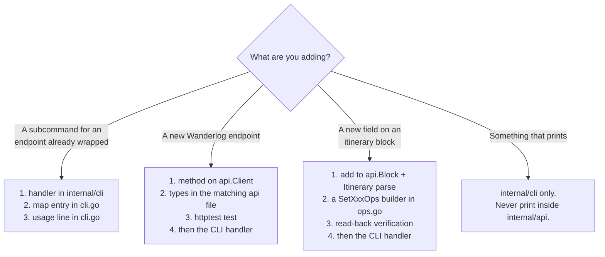
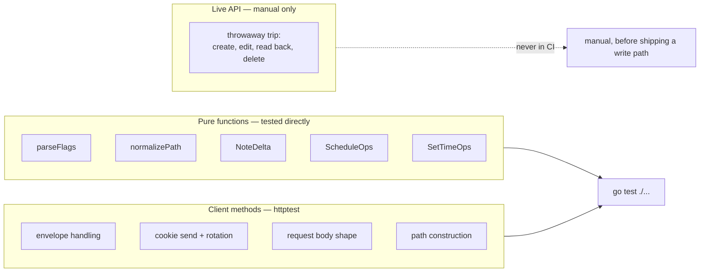

# Extending wlog

How to add a command, wrap a new endpoint, and test it — with a worked example.

Prerequisite: [ARCHITECTURE.md](ARCHITECTURE.md).

---

## Where code goes



The layering rule from ARCHITECTURE.md is the one to keep: `internal/api` never
prints and never calls `os.Exit`; `internal/cli` never builds URLs.

---

## Worked example: `wlog trip rename`

Suppose you want to rename a trip. End to end.

### 1. Find out what the endpoint is

There is no documentation, so look in the compiled web bundle. The recipe from
[API.md](API.md):

```bash
# The SPA shell lists the eager bundles
curl -s https://wanderlog.com/api/auth/me | grep -oE 'https://[^"]*\.js'

# main.js embeds a webpack manifest of ~275 lazily-loaded chunks.
# Many routes appear ONLY in those, so download them too, then:
grep -ohE '"/api/[A-Za-z0-9_/.-]*"' *.js | tr -d '"' | sort -u
```

Then grep around the route to see the method and payload. You are looking for
the `cB({url: ..., method: ..., data: ...})` call shape.

### 2. Add the client method

In `internal/api/trips.go`:

```go
// RenameTrip changes a trip's title.
func (c *Client) RenameTrip(key, title string) error {
    _, err := c.Do(Request{
        Method: http.MethodPost,
        Path:   "/api/tripPlans/" + url.PathEscape(key) + "/title",
        Body:   map[string]string{"title": title},
    })
    return err
}
```

Use `url.PathEscape` on anything interpolated into a path. Use `Client.JSON`
when you need the `data` payload unwrapped, `Client.Do` when you only care about
success or the route is non-standard.

### 3. Test against httptest, not the live API

```go
func TestRenameTripSendsTitle(t *testing.T) {
    var got map[string]any
    srv := httptest.NewServer(http.HandlerFunc(func(w http.ResponseWriter, r *http.Request) {
        _ = json.NewDecoder(r.Body).Decode(&got)
        if r.URL.Path != "/api/tripPlans/KEY/title" {
            t.Errorf("path = %q", r.URL.Path)
        }
        w.Header().Set("Content-Type", "application/json")
        _, _ = w.Write([]byte(`{"success":true}`))
    }))
    defer srv.Close()

    c := New("sess")
    c.BaseURL = srv.URL

    if err := c.RenameTrip("KEY", "New name"); err != nil {
        t.Fatalf("unexpected error: %v", err)
    }
    if got["title"] != "New name" {
        t.Errorf("title = %v", got["title"])
    }
}
```

Point `Client.BaseURL` at the test server. That exercises the real marshalling,
cookie handling and envelope parsing — the parts that actually break.

### 4. Add the CLI handler

In `internal/cli/trip.go`:

```go
var tripRename = wrap(func(args []string) error {
    fs := flag.NewFlagSet("trip rename", flag.ContinueOnError)
    title := fs.String("title", "", "new title (required)")
    if err := parseFlags(fs, args); err != nil {
        return err
    }
    key, err := requireArg(fs, "key")
    if err != nil {
        return err
    }
    if *title == "" {
        return errors.New("--title is required")
    }

    c, err := authedClient()
    if err != nil {
        return err
    }
    if err := c.RenameTrip(key, *title); err != nil {
        return err
    }
    return emit(map[string]any{"renamed": true, "key": key, "title": *title})
})
```

Five conventions, all load-bearing:

| Convention | Why |
|---|---|
| `wrap(func(args []string) error)` | maps errors onto exit codes, handles `notLoggedIn` |
| `parseFlags(fs, args)`, never `fs.Parse(args)` | lets flags appear after positionals — see ARCHITECTURE.md |
| `authedClient()` when a session is needed | fails fast with a clear message instead of a server error |
| `requireArg(fs, "key")` for positionals | consistent "missing required argument" message |
| `emit(...)` for output | pretty JSON on stdout, which is the machine contract |

### 5. Register it

Two edits in `internal/cli/cli.go` — the dispatch map and the usage text:

```go
"rename": tripRename,
```

```text
  wlog trip rename <key> --title T
```

Forgetting the usage line is the easiest mistake; nothing tests for it.

### 6. Verify

```bash
gofmt -w . && go vet ./... && go test ./...
go build -o wlog ./cmd/wlog
```

<details>
<summary><b>Advanced — destructive commands and the confirmation convention</b></summary>

Anything that destroys data requires an explicit flag. `trip delete` refuses
without `--yes`:

```go
if !*yes {
    return errors.New("refusing to delete without --yes")
}
```

This matters more than usual here because the caller is often an agent, which
will happily run whatever it constructs. The flag forces destructive intent into
the command line, where a human reading a transcript can see it.

`remove-place` does **not** require `--yes`, which is arguably inconsistent. The
reasoning: removing a place from a day is routine and trivially reversible by
re-adding, whereas deleting a trip is neither. If you disagree the fix is one
line — but it would break existing agent scripts.

Also: `POST /api/tripPlans/{key}/restore` exists, so trip deletion is soft and
recoverable for some window. This is **untested**. It is listed in API.md but
has never been exercised — do not treat it as a safety net without verifying it.
</details>

<details>
<summary><b>Advanced — adding a field to an itinerary block</b></summary>

To edit a block field `wlog` does not yet handle — say `travelMode`, which
exists on place blocks:

**1. Add it to `api.Block`** and to the anonymous parse struct inside
`Client.Itinerary`. The parse struct mirrors the wire shape; `Block` is the
flattened view with array indices attached.

**2. Write a `SetXxxOps` builder in `ops.go`**, following `SetTimeOps`:

```go
func SetTravelModeOps(b Block, mode string) []Op {
    p := []any{"itinerary", "sections", b.SectionIndex, "blocks", b.BlockIndex, "travelMode"}
    op := Op{P: p, OI: mode}
    if b.TravelMode != "" {
        op.OD = b.TravelMode // json0 replace carries the old value
    }
    return []Op{op}
}
```

Emit nothing when the value is unchanged — `ApplyOps` short-circuits on an empty
slice, so a no-op command makes no request at all.

**3. Verify the write landed.** Every index-addressed write needs a read-back,
because a concurrent edit shifts indices and the op silently hits the wrong
block while still returning success. Copy the shape of `verifyTimes`: re-read,
find the block **by `BlockID`**, confirm the value. The hazard is explained in
[SCHEDULING.md](SCHEDULING.md).

**4. Reuse `findBlock`** in the CLI handler and you get `--nth` for free. A place
can legitimately appear twice in one day.

Op builders are pure functions, so test them without a server:

```go
func TestSetTravelModeOpsSkipsUnchanged(t *testing.T) {
    b := Block{SectionIndex: 1, BlockIndex: 2, TravelMode: "walk"}
    if ops := SetTravelModeOps(b, "walk"); len(ops) != 0 {
        t.Errorf("expected no ops for an unchanged write")
    }
}
```
</details>

---

## Testing



**No test touches the network.** `go test ./...` is safe to run anywhere.

The op builders and `ScheduleOps` are pure by design, so the trickiest logic in
the repo is testable without a server. `ScheduleOps` returns ops that apply
*sequentially*, so its test simulates the moves against an array rather than
comparing ops for equality — see `simulate()` in `client_test.go`.

<details>
<summary><b>Advanced — verifying against the live API without wrecking anything</b></summary>

When you change a write path, unit tests are not enough. Every failure that has
mattered was a payload-shape mismatch the server accepted or rejected in an
undocumented way.

The protocol that works:

1. **Create a throwaway trip.** Never experiment on a real one.

   ```bash
   wlog trip create --geo kyoto --title "ZZ probe (delete me)" \
       --start 2026-11-02 --end 2026-11-03
   ```

2. Run the new path against it.

3. **Read the document back and inspect it** — not the command's own success
   output. `wlog trip get <key>` and look at the JSON.

4. `wlog trip delete <key> --yes`.

Step 3 is the one people skip, and it is the one that catches things. Bugs found
only this way:

- `POST /api/tripPlans` rejecting partial bodies with a useless `unexpectedError`
- `type` being `"plan"`, not `"tripPlan"`
- section ids being numbers, not strings
- `GET /api/tripPlans/{key}` needing `clientSchemaVersion` **and** returning its
  payload at the top level rather than under `data`
- notes being Quill deltas — caught by diffing a `wlog`-written note against one
  written in the web app, because the server accepted the wrong shape silently
  and reported success

If a write silently does the wrong thing, suspect the payload shape first. The
server's `unexpectedError` names nothing useful.
</details>

<details>
<summary><b>Advanced — validating the mermaid in these docs</b></summary>

The diagrams are not checked by CI, and a broken one renders as a grey error box
on GitHub. A syntax error is easy to introduce — a semicolon inside a
`sequenceDiagram` note acts as a statement separator, for instance, which broke
one of the diagrams in SCHEDULING.md.

To check them locally:

```bash
npm install mermaid@11 jsdom
```

Then parse each fenced block with `mermaid.parse()` under a jsdom global (
mermaid pulls in DOMPurify, which needs a DOM even for parse-only). Two traps
worth knowing if you write your own checker:

- Strip carriage returns before matching fences, or a CRLF file yields zero
  blocks and the check silently passes.
- `mermaid.parse` throws on invalid syntax but the message is the useful part —
  print it, do not just count failures.
</details>

---

## Style

Matching the surrounding code matters more than any rule here, but the
conventions in force:

- **Comments explain *why*, not *what*.** This codebase is dense with
  non-obvious API behaviour; that is what earns a comment. Delete narration that
  restates the next line.
- **No doc comments on obvious functions.** `ListTrips` does not need
  `// ListTrips lists trips.`
- **Errors are lowercase and actionable**, naming the next step where possible:
  `"--section and --place are both required"`, not `"invalid input"`.
- **Stdlib only.** No third-party dependencies, so `go install` works anywhere
  and there is no supply chain to audit. Resist adding a CLI framework.
