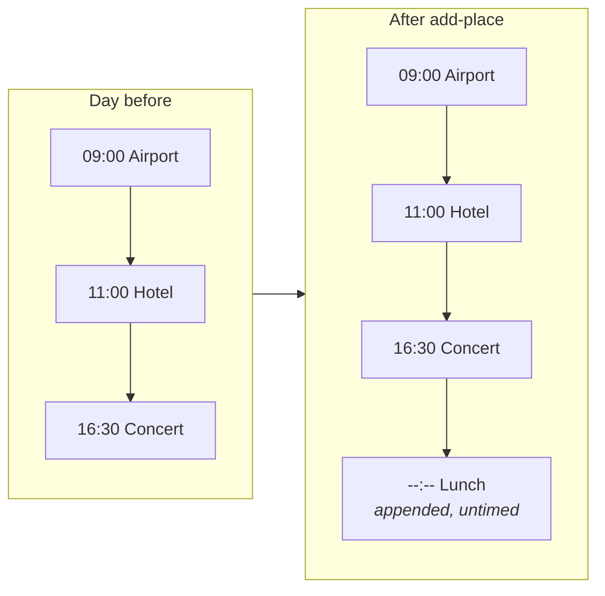
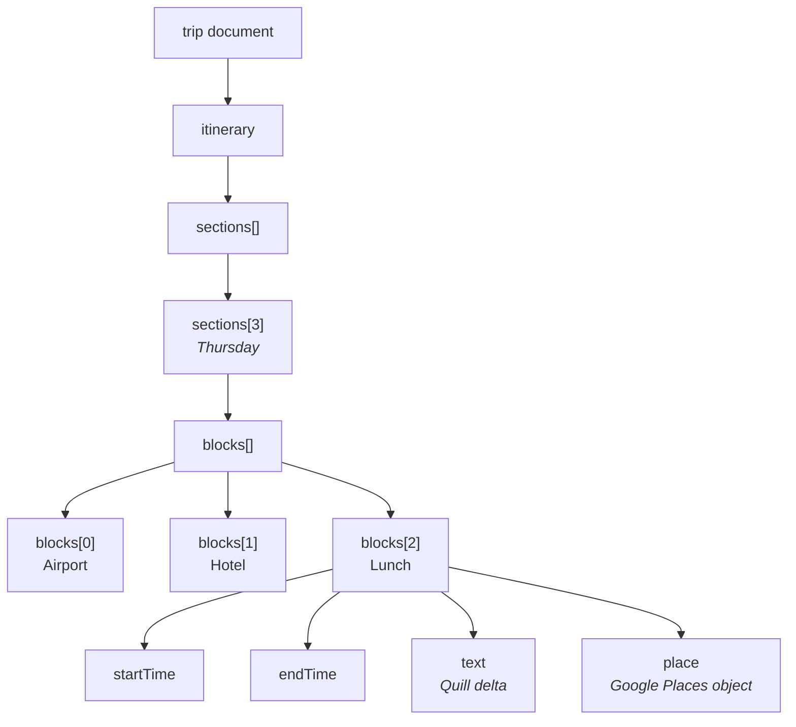
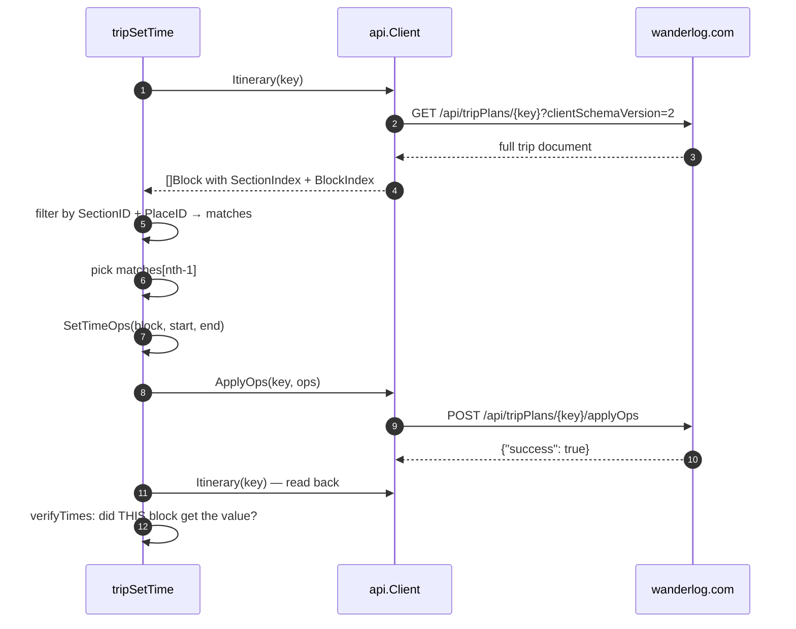
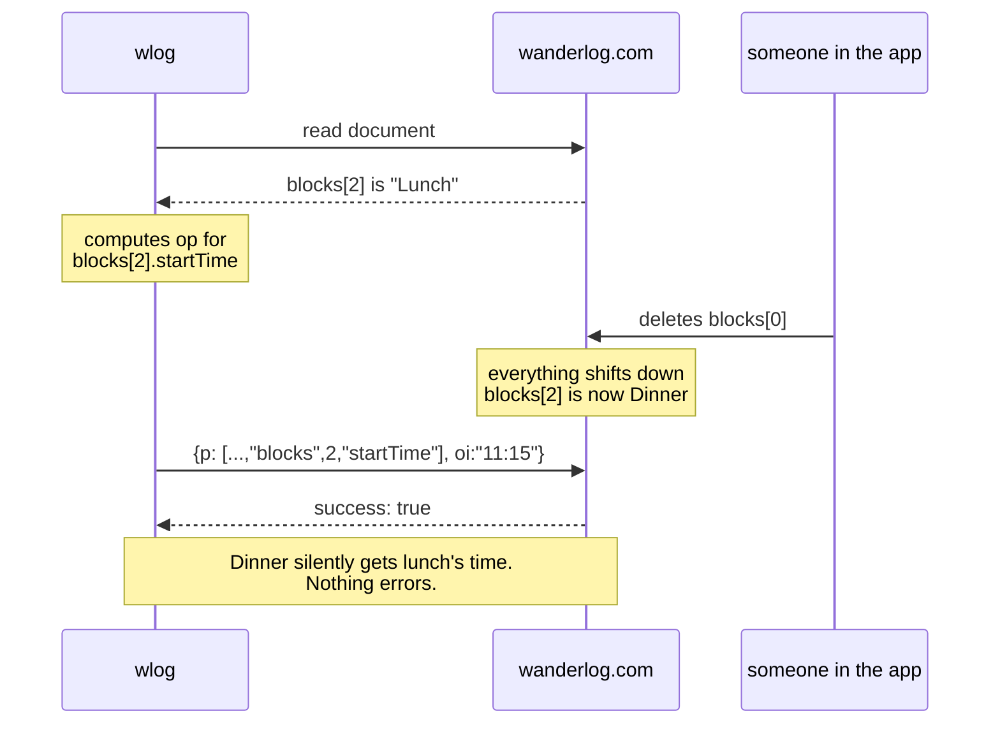
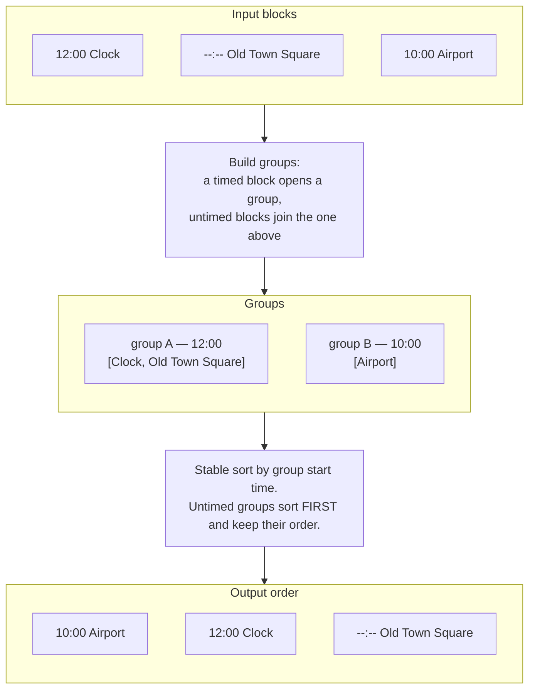
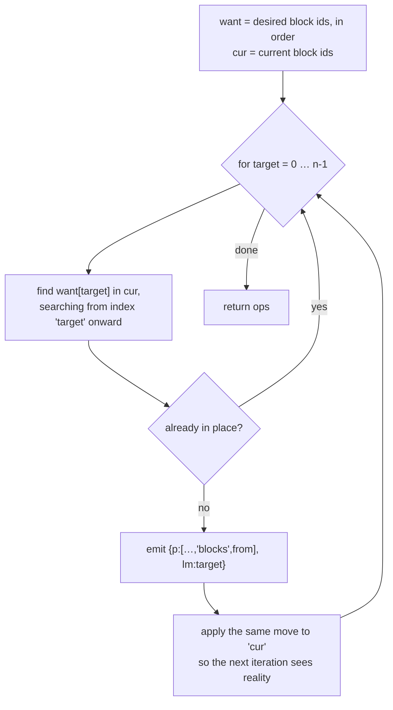
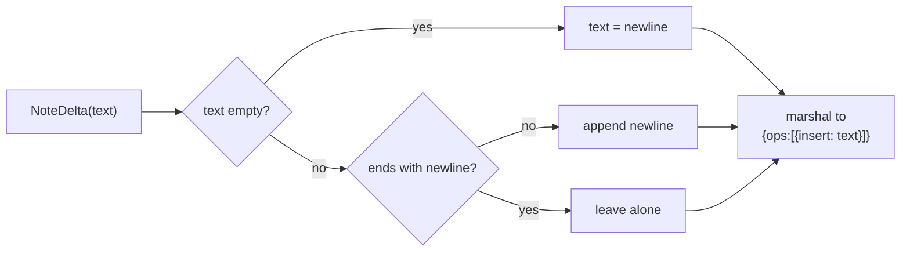

# Scheduling and itinerary editing

How `set-time`, `set-note` and `schedule-day` work, and why they are the most
delicate code in the repo.

Prerequisite: [ARCHITECTURE.md](ARCHITECTURE.md).

---

## The problem

A Wanderlog day is a **timeline**. Each entry carries a real `startTime` and
`endTime`, and the app renders the day in list order.

But `POST .../places` — the endpoint that adds a place — **only appends**. There
is no position argument and no way to set a time. So anything you add lands at
the bottom of the day with no time on it:



Lunch belongs at 11:15, not at the end of the day. Fixing that needs two things
the REST endpoints cannot do: **write a time onto an existing entry**, and
**move an entry within its day**.

Both go through `applyOps`.

---

## `applyOps` and json0

Wanderlog's itinerary is an **operational-transform document** — the same
machinery that lets two people edit a trip simultaneously. The edit channel is:

```
POST /api/tripPlans/{key}/applyOps
{"ops": [ … ]}
```

No revision number, no version — just a list of operations. The operations are
**ShareDB json0**, and `wlog` uses three of them:

| Op | Meaning | Example |
|---|---|---|
| `{p, oi}` | **o**bject **i**nsert — set a key | set `startTime` that was `null` |
| `{p, od, oi}` | replace — carry the old value alongside the new | change `"10:00"` → `"11:30"` |
| `{p, lm}` | **l**ist **m**ove — move an array element | move block 2 to position 0 |

`p` is a **path into the trip document**, expressed as array indices:



So setting lunch's start time is:

```jsonc
{"p": ["itinerary","sections",3,"blocks",2,"startTime"], "oi": "11:15"}
```

and moving it to the front of the day is:

```jsonc
{"p": ["itinerary","sections",3,"blocks",2], "lm": 0}
```

The Go type is `api.Op` in `internal/api/ops.go`. `OI`, `OD` and `LM` are all
`omitempty` so the JSON carries only the fields a given op uses.

<details>
<summary><b>Advanced — how this was discovered, and what else json0 offers</b></summary>

None of this is documented. It was found by:

1. Grepping the compiled web bundle for the `applyOps` call site, which showed
   the payload was just `{ops}` — no revision.
2. Grepping for the json0 marker keys (`li`, `ld`, `lm`, `oi`, `od`) and finding
   `function O(e,t){return {p:e, lm:t}}` — textbook json0 list-move.
3. Confirming the path root by creating a **throwaway trip**, running ops
   against it, and reading the result back. Never experiment on a real trip.

json0 also defines `li`/`ld` (list insert/delete), `si`/`sd` (string
insert/delete) and `na` (number add). `wlog` does not use them:

- `li` would let you insert a block directly, bypassing `POST .../places` — but
  you would have to construct the whole block including the Google Places object
  and a valid block id. The REST endpoint does that correctly; do not reinvent it.
- `ld` would delete a block by index, which is *more* precise than
  `remove-place` (which deletes every block matching a `place_id`). This is a
  genuine gap — see the note on `remove-place` at the end of this document.

**Why `od` matters.** Strict json0 requires `od` when replacing an existing key;
`oi` alone is for a key that is absent or null. In testing the server accepted
`oi` alone in both cases, but `SetTimeOps` and `SetNoteOps` still send `od` when
there is a prior value. Being correct against the spec costs nothing and
protects against the server tightening validation later.
</details>

---

## `set-time`

The simple one. Find the block, build one or two ops, send them.



Two details that are not obvious:

**`--nth` exists because a place can legitimately appear twice in one day.** A
hotel at bag-drop in the morning and again at check-in in the afternoon; a
palace visited as a museum and returned to for an evening concert. Without
`--nth`, `set-time` matched only the first and the second was unreachable.

**`SetTimeOps` skips no-op writes.** If the value is unchanged it emits nothing,
so `ApplyOps` short-circuits on the empty slice and no request is made.

<details>
<summary><b>Advanced — the index-shift hazard, and why every write is verified</b></summary>

This is the sharpest edge in the codebase.

json0 paths address blocks by **array index**, and `applyOps` has **no
compare-and-swap**. There is a window between reading the document and writing
to it. If anyone edits the trip in that window — a person in the Wanderlog app,
a second agent, a collaborator — the indices shift and your op lands on a
**different block**, while still returning `success: true`.



The API offers no conditional write, so this **cannot be prevented**. What the
code does instead is **detect** it:

- `verifyTimes` re-reads the document, finds the block **by its stable
  `BlockID`** (not by index), and confirms it actually holds the value that was
  written. A mismatch becomes a loud error naming what it found.
- `verifyOrdered` does the equivalent for `schedule-day`: re-reads the section
  and confirms the timed blocks genuinely ascend.

A failed read-back is deliberately **not** treated as a failure — by then the
write has already happened, and reporting a network blip as a failed write would
be wrong.

The honest guarantee is therefore: *detection, not prevention*. If you see
"write landed wrong", someone else touched the trip at the same moment. Re-run.

This is also why `set-note` exists. Editing a note by remove-and-re-add would
call `remove-place`, which deletes by `place_id` — on a day where a place
appears twice, that destroys both blocks.
</details>

---

## `schedule-day` — the interesting one

`schedule-day` reorders a day chronologically. The naive implementation — sort
every block by `startTime` — is wrong, and understanding why is the point of
this section.

### Untimed blocks are not independent

Real itineraries mix timed anchors with untimed follow-ons:

```
12:00  Astronomical Clock
--:--  Old Town Square          ← belongs with the Clock
14:30  Bánh Mì Makers
--:--  Municipal House          ← belongs with lunch
--:--  Powder Tower             ← belongs with lunch
```

A strict sort by time sweeps every untimed entry to one end, scattering
groupings the user built on purpose. So `ScheduleOps` treats the day as
**groups**: each timed block starts a group, and untimed blocks attach to the
group above them. Groups are sorted; their internals never move.



### Turning a target order into moves

Knowing the desired order is not enough — json0 only offers *move element from
index X to index Y*, and **each move shifts the indices the next move sees**.

`ScheduleOps` therefore simulates the array as it emits ops:



This is selection sort expressed as moves. The `apply the same move to cur` step
is the one that must not be forgotten — without it, every op after the first
targets a stale index.

<details>
<summary><b>Advanced — the sort comparator, and where untimed groups land</b></summary>

```go
sort.SliceStable(idx, func(a, b int) bool {
    ga, gb := groups[idx[a]], groups[idx[b]]
    if (ga.start == "") != (gb.start == "") {
        return ga.start == ""   // untimed groups sort BEFORE timed ones
    }
    return ga.start < gb.start
})
```

Three decisions encoded here:

1. **`SliceStable`, not `Slice`.** Two groups at the same time, and every pair
   of untimed groups, keep their existing relative order. An unstable sort would
   shuffle them arbitrarily on every run — the command would not be idempotent.

2. **Untimed groups sort first, not last.** A group with no time is usually
   something not yet scheduled, and burying it at the bottom of the day hides it
   below the evening. Front is more visible. (A group can only be untimed if it
   is the *first* group in the day — otherwise it would have attached to the
   timed group above it.)

3. **Times compare as strings.** `"09:00" < "10:30"` is correct lexicographically
   because the format is zero-padded `HH:MM`. `validTime` in `cli/schedule.go`
   enforces the format, but note its regex accepts `9:00` as well as `09:00` —
   a single-digit hour would sort **after** `10:00`. Wanderlog itself always
   writes zero-padded values, so this has not bitten in practice, but it is a
   latent bug: tighten the regex to `^([01]\d|2[0-3]):[0-5]\d$` if you ever
   write times from a source other than the CLI.

**Idempotence.** Running `schedule-day` twice is a no-op the second time:
`ScheduleOps` returns an empty slice when nothing needs moving, and `ApplyOps`
short-circuits on empty. `TestScheduleOpsNoMovesWhenAlreadyOrdered` pins this.

**Which sections get touched.** With no `--section`, `targetSections` selects
only sections whose `displayHeading` starts with a weekday name — so "Places to
visit", "Notes", "Food" and other standing buckets are left alone. That is
`isDayHeading`, and it is a heuristic on a display string. It would break under
a non-English locale; the CLI sends `language=en` so headings come back in
English, which is what makes it safe.

**Sections are re-read between writes.** The loop calls `c.Itinerary(key)` fresh
for each section rather than reusing one read, because the previous section's
moves have already shifted indices in the live document.
</details>

<details>
<summary><b>Advanced — why <code>plannedOrder</code> duplicates the grouping logic</b></summary>

`cli/schedule.go` has `plannedOrder`, which rebuilds the same grouping and sort
in order to render the `--dry-run` preview. This is duplicated logic and it is a
real smell.

It exists because `ScheduleOps` returns *ops*, not an ordering — there is no
intermediate value describing "what the day will look like". Reconstructing the
preview from the ops would mean simulating them, which is more code than
redoing the sort.

The right fix is to have `ScheduleOps` return `(ops, plannedOrder)` and delete
the duplicate. It has not been done because the two are only ~30 lines and the
tests cover `ScheduleOps` directly. If you change the grouping rule, **you must
change both** or the dry-run will lie about what the real run does.
</details>

---

## Notes are rich text

`text` on a block is **not a string**. It is a Quill delta:

```jsonc
{"ops": [{"insert": "go at sunrise to beat the crowds\n"}]}
```

An empty note is `{"ops":[{"insert":"\n"}]}` — a lone newline.

The trap: **the server accepts a bare string and stores it verbatim.** No error,
`success: true`, exit 0. The note then exists in a shape the editor never
produces. This was shipped and caught only by comparing a note written by `wlog`
against one written by the web app.

`api.NoteDelta` is the only correct way to build the value. It appends the
trailing newline a Quill document requires, without doubling one already there.



---

## Known gaps

Honest list of what this code does not do.

| Gap | Impact | Fix |
|---|---|---|
| `remove-place` deletes by `place_id`, so it removes **every** matching block in the section | Cannot delete one occurrence of a twice-visited place | Use json0 `ld` with the block index, plus a read-back verify |
| No `--nth` on `remove-place` | Same as above | Same |
| `plannedOrder` duplicates `ScheduleOps` grouping | Dry-run can drift from the real run | Return the order from `ScheduleOps` |
| `validTime` accepts `9:00` | Single-digit hours would sort wrong | Tighten the regex |
| Writes are verified, not guarded | Concurrent edits are detected after the fact, not prevented | Nothing to do — the API offers no conditional write |
| Moving a block between sections is unsupported | Relocating a place means add-then-remove, which changes its block id and loses its note | json0 `ld` + `li` in one batch |
