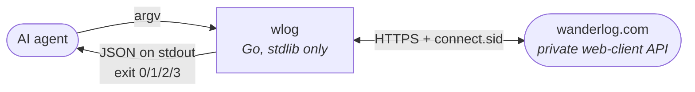

# wlog documentation

`wlog` is a small, dependency-free Go CLI that lets an AI agent build trips on
[Wanderlog](https://wanderlog.com): find destinations, search places, create
trips, and schedule them onto a day.

Wanderlog has no public API. This drives the same private HTTP API the web app
uses, and can break without notice. Use it only with your own account.

---

## Read in this order

| | |
|---|---|
| **[Architecture](ARCHITECTURE.md)** | How the code is laid out, how a command travels from `argv` to HTTP and back, and the exit-code contract. Start here. |
| **[Scheduling](SCHEDULING.md)** | Itinerary editing — times, ordering, notes — and the json0 operation engine underneath. The least obvious code in the repo. |
| **[Extending](EXTENDING.md)** | Adding a command or wrapping an endpoint, with a worked example and the testing protocol. |
| **[HTTP API](API.md)** | Wanderlog's private API, endpoint by endpoint, with the payload shapes that actually work. |
| **[Auth](AUTH.md)** | The session-cookie scheme, how it was determined, and how credentials are stored. |

Every page is written in two layers: the main text assumes no familiarity with
the codebase, and collapsed **Advanced** sections carry the detail that matters
once you are changing the code rather than reading it.

---

## The shape of the thing



Three properties make it usable by something that is not a human:

- **Output is always JSON** on stdout; errors go to stderr. Nothing prompts.
- **Exit codes are stable** — `3` specifically means the session lapsed, so an
  agent can trigger re-auth without parsing error text.
- **Flags may appear anywhere**, before or after positional arguments.

---

## Quick start

```bash
go install github.com/KRamdath/wanderlog-cli/cmd/wlog@latest

# Google/Apple/Facebook accounts have no password — paste a browser cookie.
wlog auth login --cookie 's%3A...'
wlog auth status

wlog geo search "kyoto"
wlog trip create --geo kyoto --title "Kyoto in spring" --start 2026-04-01 --end 2026-04-05
wlog trip sections <key>
wlog trip add-place <key> --place "Fushimi Inari Taisha" --geo kyoto --section <sectionId>
```

A day is a **timeline**, and places are appended to the end of it. To get them
in the right order, give them times and sort:

```bash
wlog trip set-time <key> --section <sectionId> --place ChIJ... --start 09:00 --end 10:30
wlog trip schedule-day <key> --dry-run
wlog trip schedule-day <key>
```

Why that takes two steps, and what happens underneath, is
[Scheduling](SCHEDULING.md).
